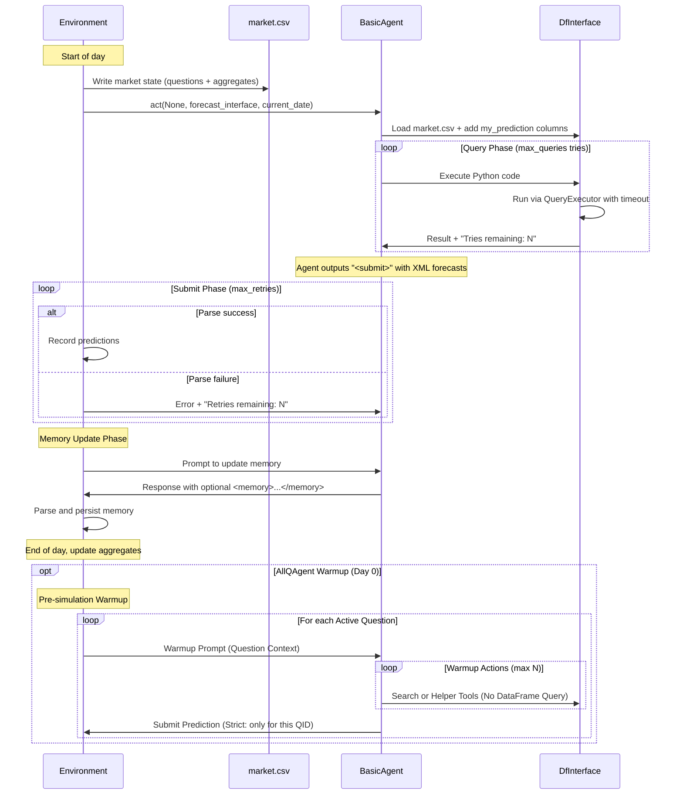

# Agent-Forecast Interaction Design

This document describes how forecasting agents interact with the simulation environment.

---

## Overview



---

## Questions DataFrame Schema

Agents receive access to a pandas DataFrame `df` with all questions:

| Column | Type | Description |
|--------|------|-------------|
| `qid` | str | Unique question ID |
| `title` | str | Question text |
| `background` | str | Context/background |
| `resolution_criteria` | str | How resolved |
| `answer_type` | str | "yes/no", "string", "numeric" |
| `resolution_date` | str | When resolves (YYYY-MM-DD) |
| `is_resolved` | bool | True if resolved |
| `ground_truth` | str/None | Answer (only if resolved) |
| `market_aggregate` | str (JSON)/None | e.g. '{"Yes": 0.6}' |
| `num_predictions` | int | Total predictions from all agents |
| `my_prediction` | dict/None | This agent's current prediction (added by DfInterface) |
| `my_prediction_date` | date/None | When agent last predicted (added by DfInterface) |

**Note**: `market_aggregate` is stored as JSON string in CSV. `my_prediction` and `my_prediction_date` are populated by `DfInterface` when loading the CSV, not stored in the file.

---

## Scoring Rules

- **Brier Skill Score**: Range [-1, +1], higher = better. Score of 0 = abstainer baseline.
- **Peer score** = 100 × (your_brier - average_of_others). Zero-sum.
- **Single-agent**: Compared against virtual abstainer (score 0) → peer_score = 100 × brier_score

---

## Agent Initial Prompt Template

```
=== FORECASTING SIMULATION - Day {current_date} ===

You are a forecasting agent. Your goal: make accurate probability predictions.

## SCORING RULES
- Brier Skill Score: Range [-1, +1], higher = better. Score of 0 = abstainer baseline.
- Peer score = 100 × (your_brier - average_of_others). Zero-sum with other agents.
- If you don't predict on a question, you're scored as if you predicted the market aggregate.

## AVAILABLE DATA
DataFrame `df` with {n_rows} rows. Columns:
{columns_desc}

Current simulation date available as `today`.

## INTERACTION RULES

QUERY PHASE (max {max_queries} queries):
- Write Python code in ```python ... ``` blocks to explore the DataFrame
- Code has access to: df, pd, today, date, datetime, timedelta

SUBMIT PHASE:
- Say "SUBMIT:" followed by XML forecasts:
<submit>
  <forecast qid="QUESTION_ID">
    <outcome name="Yes" prob="0.7"/>
    <outcome name="No" prob="0.3"/>
  </forecast>
</submit>

Rules: probs sum ≤ 1.0, max 5 outcomes/question
```

---

## Forecast Submission Format (XML)

```xml
<submit>
  <forecast qid="15573">
    <outcome name="Intel" prob="0.55"/>
    <outcome name="Amazon" prob="0.25"/>
    <outcome name="Other" prob="0.15"/>
  </forecast>
  <forecast qid="15580">
    <outcome name="Yes" prob="0.7"/>
    <outcome name="No" prob="0.3"/>
  </forecast>
</submit>
```

---

## Agent Memory

Agents can maintain persistent memory across simulation days. Memory is the ONLY context retained between days - all other conversation history is discarded.

### How it works:
1. At the start of each day, memory (if any) is included in the system prompt as `<memory>...</memory>`.
2. At the end of the day, the agent is prompted to optionally update its memory.
3. To update, the agent outputs `<memory>New content here</memory>` after `<reasoning>...</reasoning>`.
4. Memory is stored as a text file (`{agent_id}_memory.txt`) in the simulation output directory.

### Memory Update Format:

```xml
<reasoning>
Reflecting on today's forecasting session...
</reasoning>
<memory>
## Key Insights
- Pattern observed: many year-end questions resolve on Dec 31
- Strategy: focus on questions with clear resolution criteria

## Questions to Track
- QID 12345: Watching for news about X
</memory>
```

### Best Practices:
- Keep memory concise (a few paragraphs) to avoid consuming context window.
- Use memory for strategic insights, not raw data.
- Record what worked well or poorly.
- Track specific questions or patterns worth monitoring.

---

## Code Execution

> ⚠️ **SAFETY WARNING**: Current implementation uses `eval()` which is NOT SAFE for untrusted code. This is acceptable for testing with controlled agents, but needs proper sandboxing for production. Options to explore later:
> - RestrictedPython
> - AST whitelisting  
> - Subprocess isolation
> - Docker/container execution

Agent code has access to:
- `df` - pandas DataFrame (copy)
- `pd` - pandas module
- `today` - current simulation date
- `date`, `datetime`, `timedelta` - date utilities

Timeout: 5 seconds per query.

---

## Logging Directory Structure

```
/is/cluster/fast/sgoel/forecasting/current_sim/
└── {sim_name}/
    └── {YY-MM-DD-HH-MM-SS}/
        ├── config.json          # All hyperparameters
        ├── market.csv           # Current market state (questions + aggregates)
        ├── actions.jsonl        # Predictions
        └── agents/
            └── {agent_id}/
                ├── model_outputs.jsonl  # LLM prompts/responses
                └── {agent_id}_memory.txt # Persistent memory
```

---

## Running Tests

```bash
# Get GPU session on cluster (for VLLM)
condor_submit_bid 25 -i -append request_gpus=1 -append "requirements=TARGET.CUDACapability == 8.0" -append request_memory=40960

# Run test with OpenRouter (Dec 25-27, 2024)
python scripts/test_basic_agent.py \
  --sim_name test_run \
  --start_date 2024-12-25 \
  --end_date 2024-12-27 \
  --provider openrouter \
  --openrouter_model "mistralai/devstral-2512:free"

# Multi-agent run with config file
python scripts/test_basic_agent.py \
  --agents_config configs/agents_example.yaml \
  --sim_name multi_agent_test

# Answer matching options
--matching exact       # Normalized string comparison (lowercase, no spaces)
--matching openrouter  # LLM-based semantic matching (default)
--matcher "google/gemma-3-27b-it:free"  # Model for matching
```

---

## Files Overview

| File | Purpose |
|------|---------|
| `agents/basicAgent.py` | BasicAgent with query loop + XML parsing |
| `agents/utils/df_interface.py` | DfInterface for loading market.csv + query execution |
| `agents/utils/memory.py` | BasicMemory class for persistent memory |
| `agents/utils/forecast_parser.py` | XML forecast parsing utilities |
| `agents/allQAgent/agent.py` | AllQAgent: BasicAgent + Day 0 Warmup Loop |
| `environment/env.py` | SimulationEnvironment + SimForecastInterface + MarketWriter |
| `environment/safe_executor.py` | QueryExecutor with eval() + timeout |
| `environment/scoring/__init__.py` | Scoring with single-agent baseline |
| `environment/interfaces.py` | PredictionSubmission dataclass |
| `scripts/test_basic_agent.py` | CLI test script |

---

## Question Counts (Dec 25-31, 2024)

| Date | Resolving |
|------|-----------|
| 2024-12-25 | 27 |
| 2024-12-26 | 33 |
| 2024-12-27 | 41 |
| 2024-12-28 | 38 |
| 2024-12-29 | 27 |
| 2024-12-30 | 48 |
| 2024-12-31 | 169 |
| **Total** | **383** |
